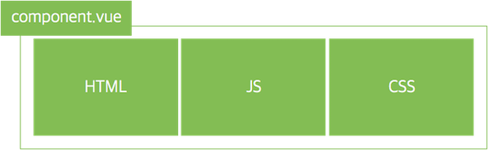
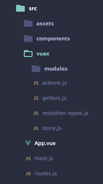

## Vue.js

1.vue.js란?

- Vue(/vjuː/ 로 발음, view 와 발음이 같음) 는 사용자 인터페이스를 만들기 위한 진보적인 프레임워크.

- SPA(Single Page Application) 용 프런트엔드 개발을 위한 프레임워크다

- UI 화면단 라이브러리(<a href="https://ko.wikipedia.org/wiki/%EB%AA%A8%EB%8D%B8-%EB%B7%B0-%EB%B7%B0%EB%AA%A8%EB%8D%B8">mvvm패턴</a>)

- 컴포넌트 기반 프레임워크

- 반응형 data < - 데이터가 변하면 뷰가 자동으로 변경

- 실제로 핵심라이브러리는 뷰 레이어에 초점을 맞추어 다른 라이브러리나 기존 사용중이던 프로젝트와의 통합이 매우 쉽다. 
<a href="https://kr.vuejs.org/v2/guide/comparison.html">다른 프레임워크 와의 비교..</a> 
<br>
<br>
<a href="https://kr.vuejs.org/v2/guide/index.html">vue.js 란..</a>


2.시작하기
- vue.js 를 실행하기 위해선 두가지 방법이 있다

1. cdn 을 사용한 라이브러리를 활용
````
<!--개발용(콘솔에서 오류,디버깅 로그 확인 가능)-->
<script src="https://cdn.jsdelivr.net/npm/vue/dist/vue.js"></script>
````
````
<!--배포용(로그 안내 기능 제거,라이브러리 에 최적화)-->
<script src="https://cdn.jsdelivr.net/npm/vue"></script>
````

2. 싱글 파일 컴포넌트 방식 <a href="https://kr.vuejs.org/v2/guide/single-file-components.html">
< 싱글파일 컴포넌트란? ></a>
- vue.cli 환경에서 생성되는 모든 vue 파일
- 화면의 특정 영역에 대한 HTML, CSS, JS 코드를 한 파일에서 관리하는 방법

    

    * app.vue 파일 생성<br>
    

3.Vue 인스턴스

- Vue object
- Vue 앱을 시작하기 위해 필수적이며, 앱의 진입점
- 간단한 템플릿 렌드링부터 데이터 바인딩, 컴포넌트 등 많은 동작 수행

````
- 뷰 관련 옵션 : el, template 
- 데이터 관련 옵션 : data, methods, computed
- 컴포넌트 관련 옵션 : components
- 생명 주기 훅 : created, mounted, updated, destroyed
````

<a href="https://vuejs.org/v2/api/">더 많은 옵션..</a>

1. vue 정의
````
<script>

var app = new Vue({     

})

<//script>
vue 를 선언하고 정의
````

2. vue el
````
<div id="app">
  <h1>안녕 , {{ title }}</h1>
</div>

<script>

var app = new Vue({     
    el: '#app' // html 을 지정
})

<//script>

vue 가 적용될 요소를 지정해주는 역할
````

3. vue data
````
<div id="app">
  <h1>안녕 , {{ title }}</h1>
</div>

<script>

var app = new Vue({     
    el: '#app', 
     data:{
        title:'난 채영이야..'
    }
})

<//script>

vue.js 에서 사용할 정보들을 선언해주는 역할
객체형태로 정보를 가지고 있다
````
4. vue methods
````
<div id="app">
  <h1>안녕 , {{ howareyou() }}</h1>
</div>

<script>

var app = new Vue({     
    el: '#app', 
     data:{
        title:'난 채영이야..'
    },
    methods:{
        howareyou(){
            return '날씨 어때?'
    }
})

<//script>

함수 저장소
````


4.템플릿

- Vue.js는 렌더링 된 DOM을 기본 Vue 인스턴스의 데이터에 선언적으로 바인딩 할 수있는 HTML 기반 템플릿 구문을 사용

 > 간단한 템플릿 구문을 사용해 선언적으로 dom 에 데이터를 렌더링 하는것

1. 보간법 
    - {{Mustache(interpolation)}}
    - data를 바인딩

2. 디렉티브
    - html 태그안에 들어가는 특별한 속성
    - v- 접두사를 사용    
    - 총 13가지 가 있다 <a href="https://vuejs.org/v2/api/#directives">더 많은 디렉티브..</a>

    <br>
    <br>

    1. v-html
    - data 내에서 html 코드를 출력할때 사용

    ````
    <div id="app">
        <h2 v-html='hello'></h2>
        
     </div>

    <script>

    var app = new Vue({
        el: '#app',
        data:{
            hello:'<a href="www.naver.con">클릭</a>'
        }
      })

    </script> 
    ````
    2. v-on
    - 이벤트 리스너의 역할
    - v-on:이벤트이름="메소드이름"

    > click 
    ````
     <div id="app">
        <h1>{{ hello }}</h1>
        <button v-on:click='btnClick()'>버튼</button>
    </div>

    <script>

      var app = new Vue({
            el: '#app', 
            methods:{
                btnClick:function(){
                    console.log('클릭');
                }
            }
      })

    </script>
    ````
    * 약어를 사용하면 간편해집니다
    ````
    <a @click="url"></a> //@ 를 사용
    ````
    > mousemove
    ````
    <div id="app">
        <h1 v-on:mousemove="mouseEx()">{{ name }}</h1>   
    </div>

    <script>

      var app = new Vue({
            el: '#app', // html 을 지정
            data: {
                name : '올려보세요'
            },
            methods:{
                mouseEx(){
                    this.name = "잘했어요";
                }             
            }
      })

    </script>
    ````

    3. v-for
    - HTML 에서 for-loop 을 구현
    - 배열기반 리스트
    - item in items 문법사용
    (items은 원본 데이터 배열, item은 반복되는 배열의 값)


    ````
    <div id="app">
        <h2>상품리스트</h2>
        <ul>
          <li v-for="list in lists">{{ list.category }}</li>
        </ul>
    </div>

    <script>
     var app = new Vue({
            el: '#app', 
            data: {
                lists:[
                    { category: '옷' },
                    { category: '신발' }
                ]
            }
      })
    </script>
    ````
    > index 부여 

    - (item, index) in items 문법사용
    ````
    <div id="app">
        <h2>상품리스트</h2>
        <ul>
          <li v-for="(list, index) in lists">{{ index }}{{ list.category }}</li>
        </ul>
    </div>
    
    ````
