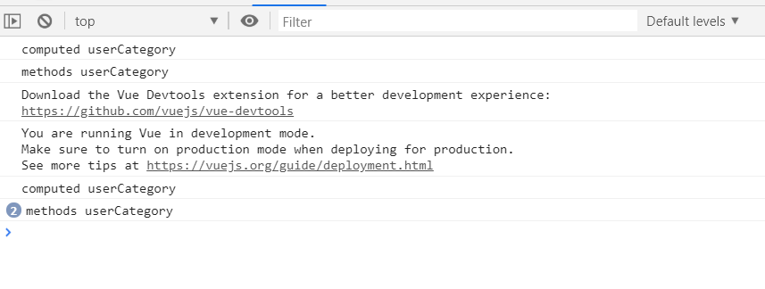
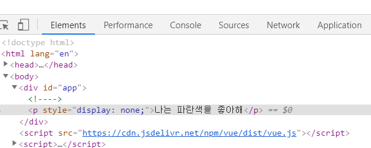
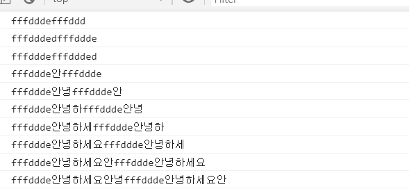

## Vue.js
#### 앞에서 배운 directive 를 더 활용해보기

### 1. directive 와 템플릿 내에 JavaScript 표현식 사용
 
* directive 에서 사용
 ````
    <div id="app">
        <ul>
            <li v-on:click="category = '슬리퍼'">카테고리 {{ category }}</li>
        </ul>
    </div>

    <script>
     var app = new Vue({
            el:'#app',
            data:{
                category:'운동화'
            }
      })
    </script>

 ````

 * 템플릿 내에 사용

 ````
     <div id="app">
        <ul>
            <li v-on:click="category = '슬리퍼'">
                카테고리 {{ category == '슬리퍼' ? '카테고리는 슬리퍼입니다' : '다시 클릭해주세요'}}
            </li>
        </ul>
    </div>
    <script>
     var app = new Vue({
            el:'#app',
            data:{
                category:'운동화'
            }
      })
    </script>


    // 클릭후 슬리퍼로 바뀌는걸 확인 할 수 있다

 ````
<br>

*위와 같은 표현식을 복잡하게 사용 할 경우 소스가 광범위 해지고 유지보수가 힘들어지기 때문에 단순한 표현식의 경우 사용가능하다 . <br>
그렇다면 다음 속성을 활용해보자*

<br>

### 2. “계산된 속성” computed

- 계산된 최초의 값을 return 
- data 속성에 변화가 있을 때 자동으로 다시 연산

````
    <div id="app">
        <ul>
            <li v-on:click="category = '슬리퍼'">
                   {{ userCategory }}
            </li>
        </ul>
    </div>

    <script src="https://cdn.jsdelivr.net/npm/vue/dist/vue.js"></script>
    <script>
     var app = new Vue({
            el:'#app',
            data:{
                category:'운동화'
            },
            computed:{ 
                userCategory:function(){
                    return this.category == '슬리퍼' ? '카테고리는 슬리퍼입니다' : '다시 클릭해주세요';
                }
            }
      })
    </script>

    //computed 객체안에 함수를 선언하여 return

````

* .computed VS methods
    
    두개의 속성 모두 최종 결과는 동일하다 

````
    <div id="app">
        <ul>
            <li v-on:click="category = '슬리퍼'">
                   {{ userCategory }}
            </li>
            <li v-on:click="category = '슬리퍼'">
                    {{ userCategory2() }}
             </li>                       
        </ul>
    </div>

    <script>
     var app = new Vue({
            el:'#app',
            data:{
                category:'운동화',
            },
            computed:{
                userCategory:function(){
                    return this.category == '슬리퍼' ? '카테고리는 슬리퍼입니다' : '다시 클릭해주세요';
                }
            },
            methods:{
                userCategory2:function(){
                    return this.category == '슬리퍼' ? '카테고리는 슬리퍼입니다' : '다시 클릭해주세요';
                }
            }
      })
    </script>
````

<br>

*결과는 같지만 차이점이 있다. <br><br>
-computed는 종속 대상(userCategory의 종속 대상은 Category)을 캐싱 <br>
-종속 대상의 값이 변하지 않는 한 다시 계산 하지 않고 캐싱결과를 즉시반환
<br>*


1. 차이를 확인 하기 위해 종속대상과 상관없는 새로운 변수를 생성
2. console.log 로 확인

````
    <div id="app">
        <ul>
            <li v-on:click="category = '슬리퍼'">
                   {{ userCategory }}
            </li>
            <li v-on:click="category = '슬리퍼'">
                    {{ userCategory2() }}
             </li>   
             <li v-on:click="other ++">
                    {{ other }}
             </li>                     
        </ul>
    </div>

    <script>
     var app = new Vue({
            el:'#app',
            data:{
                category:'운동화',
                other:0  //새로운 변수 생성
            },
            computed:{
                userCategory:function(){
                    console.log('computed userCategory')
                    return this.category == '슬리퍼' ? '카테고리는 슬리퍼입니다' : '다시 클릭해주세요';
                }
            },
            methods:{
                userCategory2:function(){
                    console.log('methods userCategory')
                    return this.category == '슬리퍼' ? '카테고리는 슬리퍼입니다' : '다시 클릭해주세요';
                }
            }
      })
    </script>
````


*각 클릭 결과를 콘솔창으로 확인해보면,computed 는 한번 실행되는 반면 methods 는 여러번 호출 되는 것을 확인할 수 있다.*


### 3. 조건부 렌더링 v-show, v-if, v-else, v-else-if 

1. v-if , v-else

- 조건상태가 true 이면 해당태그를 렌더링하고, false인 경우 렌더링을 하지 않는 디렉티브
- v-if 디렉티브는 v-else 디렉티브와 함께 사용

````
    <div id="app">
        <p v-if="red == 1">나는 빨간색을 좋아해</p>
        <p v-else>나는 파란색을 좋아해</p>
    </div>
    <script>
    
        var app = new Vue({
            el:'#app',
            data: {
                red : true
            }
        })

    </script>
````

2. template를 활용한 조건부 그룹
- 여러개의 엘리먼트를 한번에 처리할때
- v-if 디렉티브는 해당 하위 태그에도 적용됨   
- template 은 렌더링 되지 않는다

````
    <div id="app">
        <template v-if="red == 0">
            <p>나는 빨간색을 좋아해</p>
            <p>하지만 핑크색은 싫어</p>
        </template>
        <template v-else>
            <p>나는 파란색을 좋아해</p>
            <p>하지만 하늘색은 싫어</p>
        </template>
    </div>

    <script>
    
        var app = new Vue({
            el:'#app',
            data: {
                red : true
            }
        })

    </script>

```` 

3. v-show 
- v-if 디렉티브와 마찬가지로 조건 상태값에 따라 결과값이 달라진다
- template 구문을 지원하지 않으며 v-else와도 작동하지 않는다

<br>
<br>

4. v-if 와 v-show 차이
-  두 디렉티브 조건문을 false 로 적용하고 렌더링 결과를 확인해본 결과

````
    <div id="app">
        <p v-if="red == 0">나는 빨간색을 좋아해</p>
        <p v-show="red == 0">나는 파란색을 좋아해</p>
    </div>

````




*v-if 는 조건에 부합되지 않으면 렌더링 하지않는다 <br>
v-show  는 항상 렌더링 되어 DOM에 남아있고, display 속성으로 화면에 보여줄지의 여부를 판단*


| v-if | v-show | 
|:--------:|:--------:|
| 템플릿 가능 | 템플릿 불가 | 
| v-else 와 함께 사용 | v-else 사용 x | 
| 조건에 부합할 경우 렌더링 | 항상 렌더링 | 
| 토글 비용이 높다 | 초기 렌더링 비용이 높다 | 


### 3. 양방향 데이터 바인딩 v-model
- 뷰 ⇄ 데이터 형태로 바인딩 (데이터와 인스턴스가 일치)
- 양방향 데이터 바인딩을 도와주는 디렉티브가 v-model
- 폼에 관련된 태그에만 사용(select,input,textarea)

````
   <div id="app">

        <input type="text" v-model="tit">
        <p>{{tit}}</p>

    </div>


    <script>
        var app = new Vue({
            el:'#app',
            data: {
                tit : ''
            }
        })   
    </script>
````


### 3. watch 감시자
- watch는 감시할 데이터를 지정하고 그 데이터가 바뀌면 함수를 호출
- 상태 값이 변경될 때마다 같은 작업을 해야 할 경우

````
 <div id="app">
        <input type="text" name="" id="" v-model="normal">
    </div>

    <script src="https://cdn.jsdelivr.net/npm/vue/dist/vue.js"></script>
    <script>
        var app = new Vue({
            el:'#app',
            data: {
                normal : ''
            },
            watch:{
                normal:function(text){
                    console.log(text)
                }
            }
        })   
    </script>
````


*콘솔에서 확인해보면 input 에 값이 들어 올때마다 출력되는 것 을 확인 할 수 있다*


### 3. computed methods watch 비교 

|  |  | 
|:--------|:--------|
| computed | - 값을 바로 리턴 <br> - data 속성에 변화가 있을 때 자동으로 연산 <br> - 같은 페이지내에서 같은 연산을 여러번 반복할 때 사용 <br> - <a href="https://ko.wikipedia.org/wiki/%EC%84%A0%EC%96%B8%ED%98%95_%ED%94%84%EB%A1%9C%EA%B7%B8%EB%9E%98%EB%B0%8D">선언형프로그래밍 방식</a>| 
| methods | - 호출 될때 마다 값 리턴 <br> - 호출 할 때마다 새롭게 계산을 해야 하는 경우| 
| watch | - 데이터 변화를 감지 자동호출 <br> - 데이터 호출과 같이 시간이 상대적으로 더 많이 소모되는 비동기 처리에 적합<br> - <a href="https://ko.wikipedia.org/wiki/%EB%AA%85%EB%A0%B9%ED%98%95_%ED%94%84%EB%A1%9C%EA%B7%B8%EB%9E%98%EB%B0%8D">명령형프로그래밍 방식</a>|  